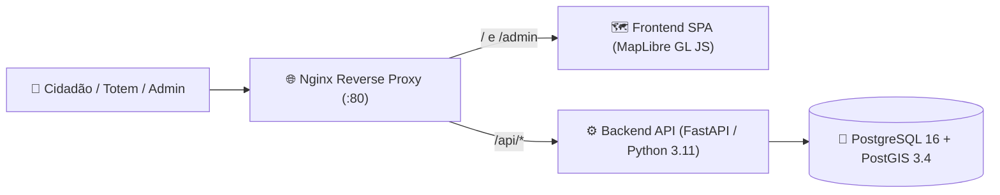

# 🏛️ Mapa Indoor — Prefeitura Municipal de Três Corações / MG

Sistema web completo de **Mapeamento Indoor 2D/3D e Localização de Setores** para o prédio da **Prefeitura Municipal de Três Corações — MG** (*Av. Brasil, 225 - Jardim América, Três Corações - MG, CEP 37410-000* — Coordenadas: `-21.67083, -45.26903`), desenvolvido com arquitetura 100% em containers Docker.

O sistema integra a planta arquitetônica oficial em CAD ([`dwg/projeto.dwg`](dwg/projeto.dwg)) e a relação de ambientes ([`TABELA.md`](TABELA.md)), georreferenciadas sobre a geometria real do edifício com **47 setores distribuídos entre o Térreo e o 1º Andar**, além de contar com um **Editor Visual de Polígonos** integrado ao painel administrativo.

---

## 🏗️ Arquitetura do Sistema



| Serviço | Container | Tecnologia | Porta (Host) | Função |
| :--- | :--- | :--- | :---: | :--- |
| **Reverse Proxy** | `indoor_nginx` | Nginx 1.27 Alpine | `80` | Ponto único de entrada, cache de estáticos e roteamento `/api/*` e `/admin` |
| **Frontend Web** | `indoor_frontend` | HTML5, CSS3, JS ES6+, MapLibre GL JS 4.7 | Interna (`80`) | Mapa interativo 2D/3D (abre direto no **Mapa Interno**) e Painel Admin com desenho visual |
| **Backend API** | `indoor_api` | Python 3.11 + FastAPI + Psycopg2 | `8000` | API REST geoespacial, persistência PostGIS e documentação Swagger (`/docs`) |
| **Banco de Dados** | `indoor_db` | PostgreSQL 16 + PostGIS 3.4 | `5432` | Armazenamento espacial de prédios, pavimentos e polígonos (`GEOMETRY(Polygon, 4326)`) |

---

## ✨ Funcionalidades Principais

### 🏛️ Guia de Atendimento e Portal do Cidadão (`/`)
- **Portal do Cidadão como Protagonista (63% da Tela)**: Interface ampla, acessível e objetiva voltada a resolver a necessidade do cidadão que entra na Prefeitura sem conhecer siglas ou números de salas.
- **⚡ Acesso Rápido por Serviço ("Mais Buscados")**: Botões de 1 clique para as demandas mais frequentes da população: `💰 IPTU & Tributos`, `📝 Protocolo Geral`, `🤝 Assistência Social`, `🏗️ Obras & Alvarás`, `🪖 Junta Militar`, `⚕️ Saúde`, `♿ Acessibilidade` e `🚻 Banheiros`.
- **🧠 Busca Inteligente por Linguagem Popular e Sinônimos**: Pesquisa dinâmica que compreende termos do dia a dia (ex: *"segunda via"*, *"renegociar dívida"*, *"alistamento"*, *"bolsa família"*, *"alvará"*, *"farmácia"*, *"remédios"*, *"carteira de identidade"*).
- **🚶 Orientação "Como Chegar" com Marcos de Referência**: Cada setor apresenta instruções humanas e fáceis (ex: *"Térreo • No saguão principal de atendimento, logo à direita da entrada da Av. Brasil"*).
- **🗺️ Mapa Discreto de Apoio Visual (37% da Tela)**: Planta arquitetônica emoldurada de forma elegante na lateral direita, funcionando como ferramenta de referência visual rápida (com seletor `Térreo / 1º Andar`, alternância `2D / 3D` e foco automático suave na sala clicada).
- **📱 Levar Mapa no Celular (QR Code)**: Botão direto em cada sala para o cidadão escanear na portaria/totem e continuar navegando pelo prédio no seu próprio celular.

### 🛠️ Painel Administrativo com Editor Visual (`/admin`)
- **Desenho Direto sobre o Prédio**:
  - **Modo `▭ Retângulo` (2 Cliques)**: Clique no 1º canto e no canto oposto para gerar a sala automaticamente alinhada.
  - **Modo `⬡ Polígono Livre` (3+ Cantos)**: Clique em 3 ou mais cantos para desenhar salas em "L", chanfradas ou irregulares. Com 3 ou mais cantos o polígono já fica visível e fixo na tela, podendo ser travado com o botão **`🔒 Fixar Polígono`**, duplo-clique ou clicando no 1º ponto.
- **Edição de Vértices Arrastáveis**: Todos os cantos (`handles`) podem ser arrastados livremente com o mouse, exibindo em tempo real as dimensões em metros e a área em $\text{m}^2$.
- **Upsert Inteligente por Código e Andar**: Se o código informado já existir no pavimento selecionado, o sistema atualiza automaticamente a geometria e os dados do setor sem erro de duplicidade.
- **Gestão Completa (CRUD)**: Criação, edição e exclusão de Prédios, Andares e Salas/Setores.

---

## 📂 Estrutura de Diretórios

```text
prefeitura-maps/
├── docker-compose.yml              # Orquestração dos 4 containers (db, api, frontend, nginx)
├── .env.example                    # Variáveis de ambiente de referência
├── TABELA.md                       # Relação oficial dos 47 setores (Térreo: 101-125 | 1º Andar: 201-222)
├── dwg/
│   └── projeto.dwg                 # Planta arquitetônica CAD original do prédio da Prefeitura
├── nginx/
│   └── nginx.conf                  # Configuração do Reverse Proxy (porta 8080)
├── data/
│   └── postgres/
│       ├── 01_schema.sql           # DDL das tabelas PostGIS (buildings, floors, rooms)
│       └── 02_seed.sql             # Carga automática inicial do banco
├── indoor/
│   ├── buildings/
│   │   └── prefeitura_municipal.geojson  # Contorno real do prédio (13 vértices georreferenciados)
│   └── rooms/
│       ├── terreo_rooms.geojson    # GeoJSON dos 25 setores do Térreo (101 a 125)
│       └── andar_1_rooms.geojson   # GeoJSON dos 22 setores do 1º Andar (201 a 222)
├── backend/
│   ├── Dockerfile
│   ├── requirements.txt
│   └── app/
│       ├── main.py                 # Endpoints FastAPI + GeoJSON PostGIS
│       ├── database.py             # Pool de conexão PostgreSQL/PostGIS
│       └── schemas.py              # Modelos Pydantic (Building, Floor, Room)
└── frontend/
    ├── Dockerfile
    ├── nginx.default.conf          # Servidor estático interno do container frontend
    ├── index.html                  # Interface principal do Mapa Indoor
    ├── admin.html                  # Interface do Painel Administrativo + Editor de Polígonos
    ├── css/
    │   ├── style.css               # Estilos do Mapa Público
    │   └── admin.css               # Estilos do Painel Administrativo
    └── js/
        ├── api.js                  # Cliente HTTP REST para comunicação com /api/*
        ├── map.js                  # Controlador MapLibre GL JS (camadas 2D/3D, seleção e câmera)
        ├── app.js                  # Lógica de UI, busca, filtros e QR Code
        └── admin.js                # Editor visual de polígonos/retângulos e CRUD administrativo
```

---

## 🚀 Como Executar o Projeto

### Pré-requisitos
- [Docker](https://docs.docker.com/get-docker/) e [Docker Compose](https://docs.docker.com/compose/install/) instalados.

### 1. Subir os containers
Na raiz do projeto (`prefeitura-maps`), execute:

```bash
docker compose up -d --build
```

### 2. Verificar o status dos serviços
```bash
docker compose ps
```

### 3. Acessar no navegador

| Interface | URL | Descrição |
| :--- | :--- | :--- |
| **🗺️ Mapa Indoor Público** | [http://localhost](http://localhost) | Abre direto no Mapa Interno da Prefeitura com busca e seletor de andares |
| **🔐 Tela de Login Admin** | [http://localhost/login](http://localhost/login) | Autenticação simples (Usuário: `admin` \| Senha: `admin123`) |
| **⚙️ Painel Administrativo** | [http://localhost/admin](http://localhost/admin) | Gestão em abas, KPIs, busca e editor visual de salas sobre o mapa |
| **📄 Swagger UI (OpenAPI)** | [http://localhost:8000/docs](http://localhost:8000/docs) | Documentação interativa da API REST |
| **❤️ Healthcheck da API** | [http://localhost/api/health](http://localhost/api/health) | Status da API e conexão com o PostGIS |

---

## 🏢 Setores Mapeados (`projeto.dwg` + `TABELA.md`)

Todos os **47 setores** foram extraídos e georreferenciados a partir do arquivo CAD [`dwg/projeto.dwg`](dwg/projeto.dwg) e da relação oficial em [`TABELA.md`](TABELA.md):

### Pavimento Térreo (`level = 0`) — 25 Setores (`101` a `125`)

| Código | Setor / Localização | Secretaria / Órgão |
| :---: | :--- | :--- |
| **101** | Dívida Ativa | Secretaria de Finanças |
| **102** | ISS | Secretaria de Finanças |
| **103** | Alfredo, Lena | Secretaria de Planejamento |
| **104** | PAV — Posto de Atendimento da Receita Federal | Secretaria de Finanças |
| **105** | Lanchonete da Prefeitura — Público | — |
| **106** | Lanchonete da Prefeitura — Funcionários | — |
| **107** | Antigo Café — Refeitório | — |
| **108** | Fiscalização Obras — Posturas | Secretaria de Planejamento |
| **109** | Arquivo RH | Secretaria de Recursos Humanos |
| **110** | IPTU | Secretaria de Finanças |
| **111** | Recepção | — |
| **112** | Sala da Faxina | — |
| **113** | Banheiros | — |
| **114** | Banheiros | — |
| **115** | Secretaria da Saúde | — |
| **116** | Departamento de Compras | Secretaria de Governo |
| **117** | Redação | Secretaria de Governo |
| **118** | Arquivo Redação | Secretaria de Governo |
| **119** | Arquivo Finanças | Secretaria de Finanças |
| **120** | Contabilidade Finanças | Secretaria de Finanças |
| **121** | Secretaria Municipal de Finanças — Tesouraria | Secretaria de Finanças |
| **122** | Setor Financeiro — Compras | Secretaria de Desenvolvimento Social |
| **123** | Setor Administrativo | Secretaria de Desenvolvimento Social |
| **124** | Folha de Pagamento | Secretaria de Administração e Recursos Humanos |
| **125** | Secretaria de Administração e Recursos Humanos | — |

### 1º Andar (`level = 1`) — 22 Setores (`201` a `222`)

| Código | Setor / Localização | Secretaria / Órgão |
| :---: | :--- | :--- |
| **201** | Gabinete da Vice-Prefeita | — |
| **202** | SECOM | Secretaria de Comunicações |
| **203** | Secretaria de Controle Interno | — |
| **204** | T.I. | — |
| **205** | Departamento de Compras | Secretaria da Saúde |
| **206** | Atenção Primária — Saúde Bucal | Secretaria da Saúde |
| **207** | Faturamento | Secretaria da Saúde |
| **208** | Setor 208 | Administração Municipal |
| **209** | Fiscalização Obras e Posturas | Secretaria de Planejamento |
| **210** | Procuradoria — Advogados | Procuradoria |
| **211** | Banheiros | — |
| **212** | Banheiros | — |
| **213** | Procuradoria — Procurador do Município | Procuradoria |
| **214** | Secretaria de Governo | — |
| **215** | Administração | Secretaria de Governo |
| **216** | Gabinete do Prefeito | — |
| **217** | Cozinha — Gabinete | — |
| **218** | Secretaria de Planejamento e Desenvolvimento Urbano e Segurança Pública e Mobilidade Urbana | Secretaria de Planejamento |
| **219** | Secretaria de Planejamento — Engenheiros | Secretaria de Planejamento |
| **220** | Meio Ambiente — Defesa Civil | — |
| **221** | Agricultura | — |
| **222** | Setor 222 | Administração Municipal |

---

## 🔌 Endpoints da API REST

### Prédios e Pavimentos
| Método | Endpoint | Descrição |
| :---: | :--- | :--- |
| `GET` | `/api/health` | Verifica saúde da API e conectividade com o PostGIS |
| `GET` | `/api/buildings` | Lista os prédios cadastrados em formato `FeatureCollection` GeoJSON |
| `POST` | `/api/buildings` | Cadastra um novo prédio |
| `PUT` | `/api/buildings/{building_id}` | Atualiza dados ou polígono de um prédio |
| `DELETE` | `/api/buildings/{building_id}` | Remove um prédio e seus andares vinculados |
| `GET` | `/api/floors` | Lista os andares (filtros opcionais: `building_id`, `level_number`) |
| `POST` | `/api/floors` | Cria ou atualiza um pavimento |
| `DELETE` | `/api/floors/{floor_id}` | Remove um pavimento |
| `GET` | `/api/floors/{floor_id}/geojson` | Retorna o GeoJSON consolidado do pavimento (`building`, `floor` e `rooms`) |

### Salas / Setores e Estatísticas
| Método | Endpoint | Descrição |
| :---: | :--- | :--- |
| `GET` | `/api/rooms` | Lista e busca setores (`floor_id`, `level_number`, `category`, `q`) |
| `GET` | `/api/rooms/{room_id}` | Detalhes completos e geometria de um setor específico |
| `POST` | `/api/rooms` | Cria um setor (ou atualiza automaticamente se `code` já existir no andar) |
| `PUT` | `/api/rooms/{room_id}` | Atualiza dados e/ou polígono GeoJSON de um setor |
| `DELETE` | `/api/rooms/{room_id}` | Exclui um setor |
| `GET` | `/api/admin/stats` | Retorna totais de prédios, andares e salas cadastradas |

---

## 🛠️ Comandos Úteis de Manutenção

```bash
# Visualizar logs da API e do Banco em tempo real
docker compose logs -f indoor_api indoor_db

# Reiniciar apenas o backend após alterações em backend/app/
docker compose restart indoor_api

# Reiniciar o frontend após alterações em frontend/
docker compose restart indoor_frontend

# Acessar o console interativo do PostgreSQL/PostGIS
docker exec -it indoor_db psql -U prefeitura -d prefeitura_indoor

# Parar todos os containers mantendo os dados salvos no volume
docker compose down
```
